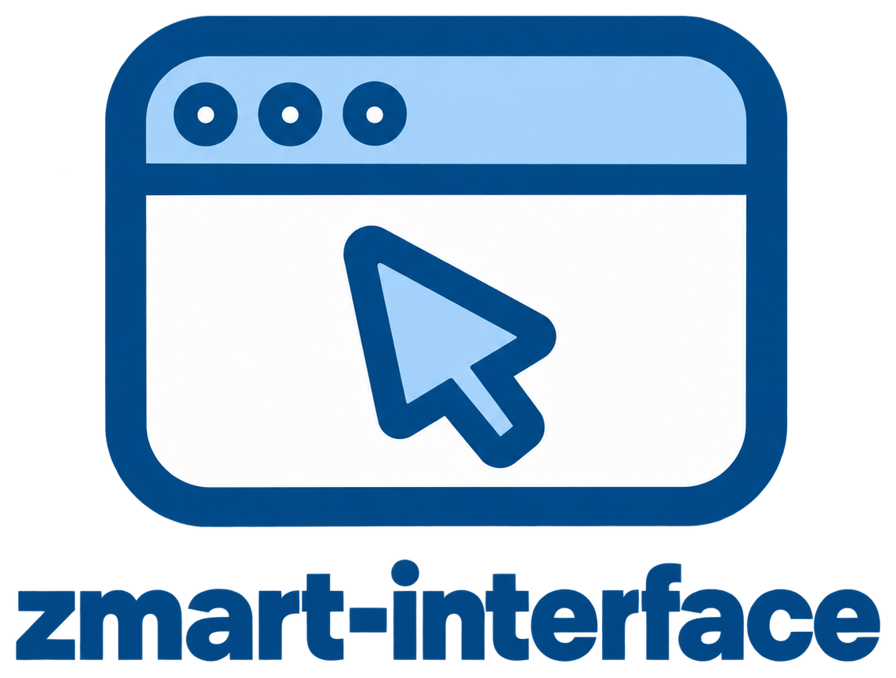

# ZMART interface

[](https://www.python.org/downloads/)
[](LICENSE)
[](#development-and-testing)
[](#status)



The **ZMART interface** is the operator window for smart microscopy: it walks you through a run step by step and draws the sample as it is acquired.
It drives the microscope only through the [ZMART Controller](https://github.com/thomdehoog/ZMART-controller), so it works on any microscope with a ZMART driver.
It is part of [**ZMART**](https://github.com/thomdehoog/ZMART-microscopy) (ZMB's Microscopy-Agnostic Research Toolkit), the tools we use for smart microscopy at the Center for Microscopy and Image Analysis (ZMB), University of Zurich.
<br clear="left"/>

## The Problem

A smart-microscopy run is a chain of decisions: where the sample is on the carrier, which
area to survey, how to keep it in focus, what counts as a target, and which targets to look
at closely. Done in the vendor's software, every one of those steps is manual, specific to
that microscope, and hard to repeat on the next sample. Done in a script, the operator loses
sight of the sample while it is being imaged, and a small mistake early in the chain is
found only at the end.

## The Solution

The interface turns the run into ten steps in a window, each with its own controls beside
a picture of the sample, and keeps every result where the operator can see and correct it:

1. **Connect** to a microscope chosen from the interface's list, and see what its driver
   reports: whether the stage answers, which limits and calibration it loaded, where images go.
2. **Define the carrier**: a slide, a dish or a well plate, aligned to the stage.
3. **Overview scan area**: the fields to survey, drawn on the carrier.
4. **Focus strategy**: a few focus points measured, and a focus map fitted through them.
5. **Scan the overview**: the survey, drawn on the canvas as each field lands.
6. **Detect objects**: the cells or structures in every field, found by ZMART-analysis.
7. **Discover targets**: gates drawn on plots of what was measured about each object.
8. **Target scan area**: where to look closely, placed over the chosen targets.
9. **Acquire targets**: each target imaged, with its own focussing first if you ask for it.
10. **Run protocol**: the whole run again on a new sample, with the settings of the last one.

It sits on top of the ZMART Controller, and two other ZMART parts plug into its sides:

- **The controller** carries every command to the microscope's driver: move, read the
  settings, acquire. Each command answers `{"success": ..., "content": ...}`; when the
  microscope says it could not do something, the interface shows that sentence where you
  pressed.
- **ZMART-analysis** scores the focus stacks and finds the objects, each step in its own
  environment, kept running between presses so a focus map is not slower than the stage.
- **ZMART-viewer** serves the run as it is written, so the canvas fills in field by field.

**The viewer slot.** The picture in the middle of the window is drawn by a *drawing
engine*, and the engine is pluggable: anything that offers the same small set of functions
(open an acquisition, follow it while it grows, show a named view, say where the operator
clicked) can fill the slot. Three engines ship with the interface today (two built on Viv
and deck.gl, one on neuroglancer). [The viewer slot](docs/viewer-slot.md) writes down what
an engine must offer, so that another viewer can be put in its place.

## Try it yourself

### Install

There are two ways to set the interface up. **Production** is for running it, on a microscope
PC or on your own computer; **development** is for changing it, and is described under
[Development and testing](#development-and-testing).

For production, the interface needs Python 3.11 or 3.12, and on Windows the WebView2 runtime
that draws its window (already part of Windows 11). Create an environment from conda-forge,
then install the interface into it. This also installs the ZMART Controller, ZMART-viewer and
the ZMART-analysis engine:

```bash
conda create -n zmart-interface -c conda-forge python=3.12 pip git
conda activate zmart-interface
pip install "zmart-interface @ git+https://github.com/thomdehoog/ZMART-interface"
```

What this installs is the interface's Python code and its page, already built. The page is
built on a developer's computer and committed with the code, so a production install needs no
Node.js, and it brings no tests and no browsers with it.

Focus maps and object detection run ZMART-analysis workflows, which live in a checkout of
the ZMART-analysis repository together with the environments they run in. Clone it, create
the environments its workflows need, and tell the interface where it is:

```bash
git clone https://github.com/thomdehoog/ZMART-analysis
python ZMART-analysis/workflows/focus/environments/setup_env.py --step main
python ZMART-analysis/workflows/object_analysis/environments/setup_env.py --step classical
setx ZMART_ANALYSIS_WORKFLOWS C:\path\to\ZMART-analysis
```

`setx` keeps the setting for every window opened after it, in PowerShell and in the Command
Prompt alike; the window it was typed in does not see it yet, so open a new one before you
start the interface.

(Installing ZMART-analysis from that checkout with `pip install -e ZMART-analysis` does the
same without the variable.)

### Run it with the mock microscope

The interface always offers a pretend microscope, so you can walk a whole run without
hardware:

```bash
zmart-interface
```

The window opens on the first step with **Mock** chosen. Press **Connect**; a second small
window opens beside it, the mock's own software, where you choose the job each step is
imaged with (Overview, Focussing, Target, ...), the way you would in the vendor's software.
Its sample is a section of a mouse kidney, which comes with the interface, so the mock works
on a computer without a network too.

### Run it on a microscope

Install the ZMART driver for your microscope (see the
[ZMART drivers](https://github.com/thomdehoog/ZMART-drivers)). Each driver has a setup of
its own, done once per microscope: its travel limits, the zero point of its coordinates and,
for some, the image orientation and objective calibration. Then install the driver into the
controller's registry once on that computer, by pointing it at the driver's `zmart_driver.json`
(or the folder holding it; the driver's README says where it is):

```bash
python -c "import zmart_controller; print(zmart_controller.register_driver('path/to/the/driver'))"
```

That file gives the driver's name and the connection it needs. The microscope then appears
in the interface's list under that name, beside the two pretend ones:

```bash
pip install "zmart-interface[drivers] @ git+https://github.com/thomdehoog/ZMART-interface"
zmart-interface
```

[Installing on a microscope](docs/install-on-a-microscope.md) walks through it on a ZMB
workstation, including the first checks to make on a new instrument.

### Status

This is a release candidate, 0.1.0rc1. The interface was taken out of the ZMART Microscopy
repository, where it has been used on a Leica STELLARIS 5 and its LAS X simulator; this
standalone version has been tested on the mock microscope. Two things are deliberately left for
later:

- **Setting a microscope up** (limits, origin, orientation, calibration) belongs to each
  driver's own setup, and is not a workflow of this interface yet.
- **One viewer engine**: the three engines in the viewer slot will later be merged with
  ZMART-viewer's own engine.

## Development and testing

To change the interface, work in a clone of this repository. Besides Python you need Node.js
22.12 or newer, which builds the page and runs its tests; conda-forge has it. The page's tests
also need a browser, which Playwright downloads. `PLAYWRIGHT_BROWSERS_PATH` decides where it
goes: point it outside your user profile, so a few hundred megabytes do not land there (on the
ZMB workstations programs may only run from `C:\ProgramData\MinicondaZMB`, so put it there).

```bash
conda create -n zmart-interface-dev -c conda-forge python=3.12 pip git "nodejs>=22.12"
conda activate zmart-interface-dev
git clone https://github.com/thomdehoog/ZMART-interface
cd ZMART-interface
pip install -e ".[dev]"
npm ci
set PLAYWRIGHT_BROWSERS_PATH=C:\ProgramData\MinicondaZMB\ms-playwright
npx playwright install chromium
```

The tests need no microscope: they run on the mock.

```bash
python -m pytest          # the bridge, the storage, the analysis seam, the mock, the built page
npm run test:unit         # the page's rules and arithmetic (vitest)
npm run build             # the page, as it ships inside the package
npx playwright test zmart_interface/workflows/target_acquisition/walk.spec.js
```

The built page in `zmart_interface/framework/window/build/` is committed, because a production
install cannot build it. After changing the page, run `npm run build` and commit that folder
with your change: one of the Python tests builds the page afresh and fails if the committed
folder differs from it. [Building the page](docs/building-the-page.md) says more.

The last line is the main acceptance test: all ten steps walked on the built page, through the
real bridge and the mock microscope, with the focus map and the detection run through
ZMART-analysis. It needs the analysis environments above.

## Author
Thom de Hoog, Center for Microscopy and Image Analysis (ZMB), University of
Zurich (thom.dehoog@zmb.uzh.ch, thomdehoog@gmail.com).

## License
MIT License. See LICENSE file for details.

## Links

- [ZMART Microscopy](https://github.com/thomdehoog/ZMART-microscopy): the main repository, where the workflows begin
- [ZMART Controller](https://github.com/thomdehoog/ZMART-controller): the one vocabulary every microscope is driven with
- [ZMART drivers](https://github.com/thomdehoog/ZMART-drivers): the drivers that plug into the controller, one per microscope
- [ZMART viewer](https://github.com/thomdehoog/ZMART-viewer): the viewer that serves the run as it is acquired
- [ZMART analysis](https://github.com/thomdehoog/ZMART-analysis): the analysis engine that runs between acquisitions
- [ZMART AI agent](https://github.com/thomdehoog/ZMART-ai-agent): driving a microscope by asking in your own words
- [Center for Microscopy and Image Analysis (ZMB)](https://www.zmb.uzh.ch), University of Zurich
